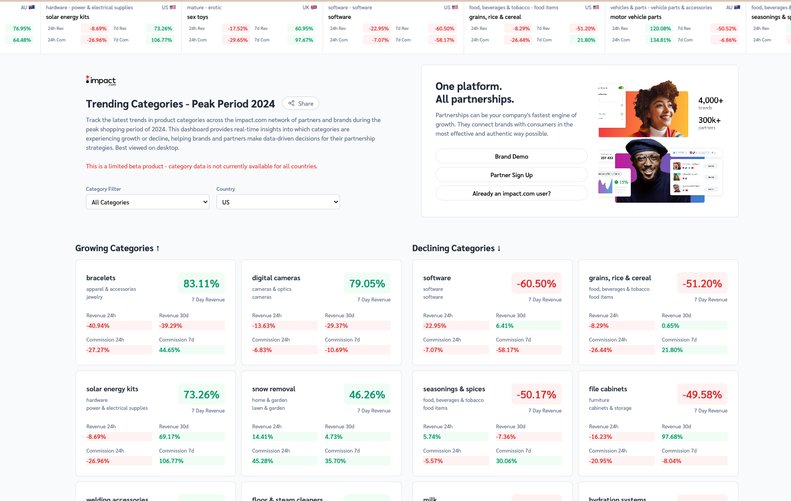

# Product Trend Analytics Dashboard


[](https://codecov.io/gh/jalexspringer/product_trend_ticker)

A real-time analytics dashboard that tracks and visualizes product category trends across the impact.com network. Built with FastAPI and HTMX for efficient, modern web development practices.



## Technology Stack

### Backend
- **FastAPI**: Modern Python web framework with async support
- **HTMX**: Dynamic UI updates without complex JavaScript
- **Jinja2**: Server-side templating
- **Prometheus**: Metrics and monitoring
- **APScheduler**: Automated data refresh scheduling

### Data Processing
- In-memory caching with expiration
- CSV data source (BigQuery-ready)
- Type-safe data models with dataclasses
- Efficient data filtering and sorting

### Frontend
- Tailwind CSS for responsive design
- Minimal JavaScript approach
- Progressive enhancement
- Mobile-responsive layout

## Features

- Real-time product category trend analysis
- Dynamic updates via HTMX
- Responsive design with Tailwind CSS
- Filterable views by category and country
- Rate limiting and request throttling
- Prometheus metrics integration
- Automated data refresh scheduling
- In-memory caching with expiration
- GZIP compression for responses
- Comprehensive logging system
- Health check monitoring

## Development Setup

### Prerequisites
- Python 3.12+
- Docker & Docker Compose
- UV package manager (`curl -LsSf https://astral.sh/uv/install.sh | sh`)

### Local Development

1. Clone the repository:
```bash
git clone https://github.com/yourusername/product_trend_ticker.git
cd product_trend_ticker
```

2. Install dependencies:
```bash
uv pip install -e ".[dev]"
```

3. Run the development server:
```bash
uv run fastapi run src/app/main.py
```

### Testing

The project uses pytest for testing. Run tests with:

```bash
uv run pytest
```

Test structure:
```
tests/
├── unit/              # Unit tests
│   ├── api/          # API endpoint tests
│   ├── database/     # Database and cache tests
│   └── utils/        # Utility function tests
├── integration/       # Integration tests
└── e2e/              # End-to-end tests
```

### Code Quality

Pre-commit hooks are configured for:
- pytest: Run tests
- ruff: Code formatting and linting
- mypy: Type checking

Install pre-commit hooks:
```bash
pre-commit install
```

## Deployment Options

### Local Development
```bash
# Clone repository
git clone <repository-url>
cd product-trend-ticker

# Start with Docker
docker-compose up --build
```

### Heroku Deployment
The application is configured for immediate deployment to Heroku using Docker containers:

1. Install the Heroku CLI and login:
```bash
heroku login
```

2. Create a new Heroku app:
```bash
heroku create your-app-name
```

3. Deploy to Heroku:
```bash
git push heroku main
```

The application uses `heroku.yml` for Docker-based deployment and automatically configures the necessary environment variables and port settings.

## Dependencies

The project uses `pyproject.toml` for dependency management with Python 3.12+. Key dependencies include:

- FastAPI (0.115.5+)
- Jinja2 (3.1.4+)
- APScheduler (3.11.0+)
- Uvicorn (0.32.1+)
- Gunicorn (23.0.0+)
- Prometheus FastAPI Instrumentator (7.0.0+)
- SlowAPI (0.1.9+)

## Project Structure

```
/app
├── templates/    # Jinja2 HTML templates
├── static/       # CSS and static assets
├── main.py      # FastAPI application entry point
├── database.py  # Data fetching and caching logic
└── config.py    # Application configuration
```

## Production Features

### Performance
- In-memory caching with configurable expiry
- GZIP compression for responses
- Efficient data filtering and sorting
- Static asset optimization

### Monitoring
- Prometheus metrics integration
- Request timing headers
- Structured logging
- Health check endpoint
- Performance monitoring headers

### Security
- Rate limiting with slowapi
- CORS configuration
- Trusted host middleware
- Environment-based configuration
- API documentation control

## Environment Variables

- `FORCE_CACHE_REFRESH`: Force refresh of cached data (default: false)
- `ENVIRONMENT`: Development or production mode
- `ALLOWED_HOSTS`: Comma-separated list of allowed hosts
- `PORT`: Application port (default: 8000)

## Docker Deployment

The application includes a production-ready Dockerfile with:
- Python 3.12 slim base image
- Multi-worker Gunicorn configuration
- Environment variable configuration
- System dependency optimization
- Proper logging setup

## Data Management

- Configurable cache refresh intervals
- Force refresh capability
- Efficient filtering and sorting
- Category and country-based segmentation
- Type-safe data handling

## Health Monitoring

The `/health` endpoint provides:
- Service health status
- Cache validity
- Data record count
- Service availability